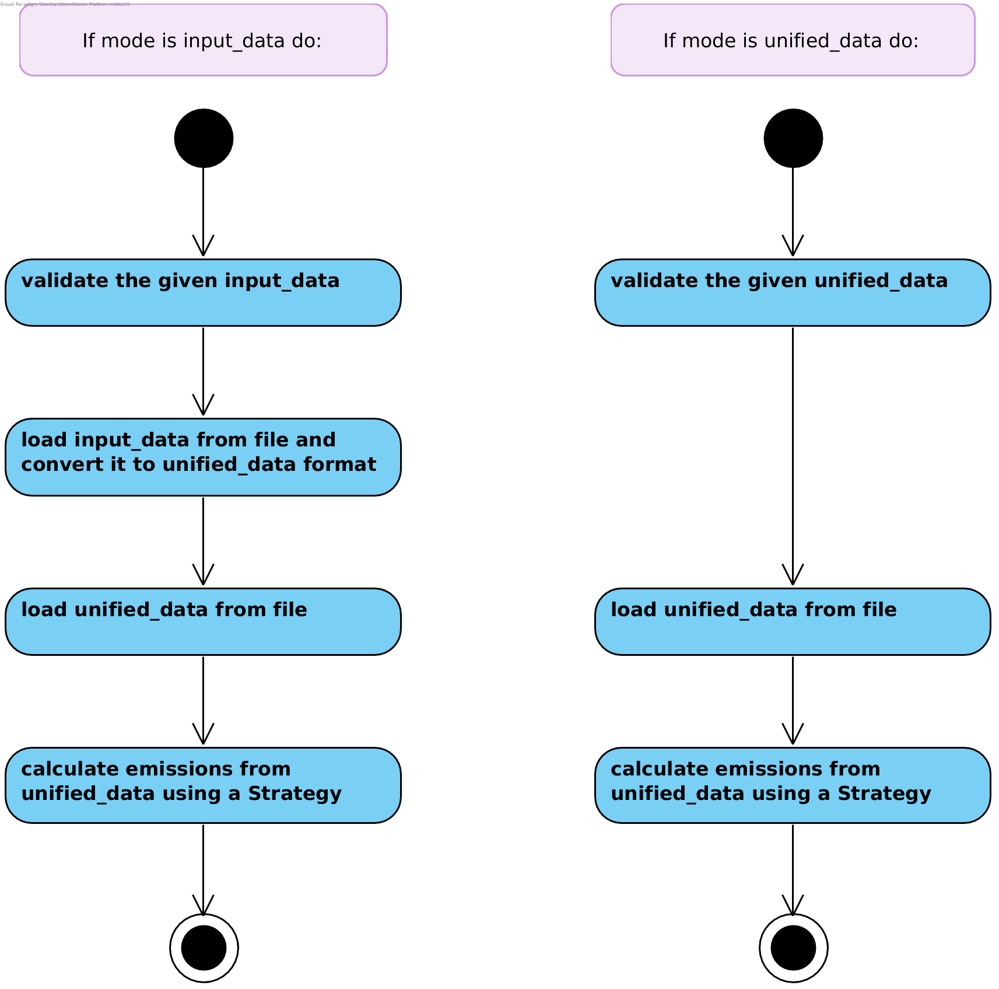

.. _Process:

How does it work?
=================

Overview
--------

Validation
----------
Data validation checks the format of the given files:

- All necessary columns are present
- The mapping files contain all the necessary values and do a correct mapping
- The levels in categorical columns are correct
- Percentage columns contain percentage values

Eather mode can use data validation. Data validation is done by a function designed specifically for data validation.
We provide validation functions for some Strategies. If you want to add data validation for your own Strategies
and datasets, look here: :ref:`add-validation-function`

Specify the validation function to be used in the config:

.. code-block:: yaml

    validation_function: path.to.the.validation_function

You may not want to use data validation or no validation function may exists for the desired Strategy.
If that is the case simply don't include the above statement in your config to skip validation.

Load input_data and convert it to unified_data
----------------------------------------------
This is the part where input_data is converted to unified_data. It is **only relevant for mode input_data**.
The conversion is done by a function. Which function you want to use depends on the format of your input_data
and on which Strategy you are looking to use. We provide functions to load and convert ``input_data``
for the input_data we were using for all Strategies.

If you want to work with your own dataset, **you will likely have to write your own function** for this.
Look here for information on how to do that: :ref:`add-load-input-data-function`

Specify the function to be used in the config:

.. code-block:: yaml

    load_input_data_function: path.to.the.input_data_loading_function

Note that the product of this step are multiple files containing the ``unified_data``. The files
will be loaded into memory in the next step.

Load unified_data from file
---------------------------
Load the unified_data dataset from file. This step is relevant for all modes. It will select the right columns
and set the correct data types.

Just like two steps above, this step is done by a function. You can specify the function to be used in the config:

.. code-block:: yaml

    load_unified_data_function: path.to.the.unified_data_loading_function

If you are working with data that can be converted to fit the unified_data format, you should not have to write your own
function for this step. If you do need to adapt how the unified_data is loaded from file, look here:
:ref:`add-load-unified-data-function`

Calculate emissions from unified_data using a Strategy
------------------------------------------------------
This step calculates and saves emissions with a Strategy. If you don't know what a Strategy is, look here:
:ref:`what-is-strategy`

Specify the Strategy to be used in the config:

.. code-block:: yaml

    strategy: path.to.the.Strategy

If you want to add a new way to calculate emissions, you need to add a new Strategy to the model. Look here for
instructions: :ref:`add-strategy`

