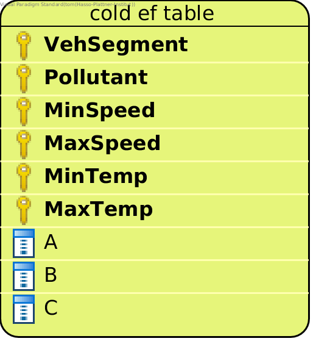

CopertColdStrategy
==================

The ``CopertColdStrategy`` implements emission calculation with the
`COPERT methodology for cold start emissions <https://www.eea.europa.eu/publications/emep-eea-guidebook-2016/>`_.
It uses global assumptions about the average length of a trip (in km/h) and the average ambient temperature
(in degrees Celsius) that are set in the configuration file.

Also in the configuration file you may specify some road types and area types that will be excluded
from the cold emission calculation. This means that cold emissions will be zero for all vehicles at links that belong
to the road types or area types that you want to exclude.
Possible road types to be excluded are: ``MW-Nat.``, ``MW-City``, ``Trunk-Nat.``, ``Trunk-City``, ``Distr``,
``Local``, and ``Access``. Area types that can be excluded are ``Rural`` and ``Urban``.

During the cold emission calculation hot emissions are calculated using the ``CopertHotStrategy`` because
cold emissions depend on hot emissions.

Output of a model run with this Strategy are three csv files:

- cold start emissions
- hot emissions
- total emissions

Data requirements
-----------------

What data the ``CopertColdStrategy`` requires depends on the ``mode`` set in the configuration file for the run.

Data requirements for mode ``input_data``
'''''''''''''''''''''''''''''''''''''''''

All ``input_data`` required by the ``CopertHotStrategy`` is also required for the ``CopertColdStrategy``.

.. _cold-ef-data-explained:

Additionally a file with **cold emission factors** is required:

:ref:`how-to-read-er`

This is the cold ef table as provided by EEA recommendations.

- *Pollutant*: One of the following: ``CO``, ``NOx``, or ``VOC``.
- *VehSegment*: A vehicle segment. One of the following: ``Mini``, ``Small``, ``Medium``, or ``Large-SUV-Executive``.
- *MinSpeed*: The minimum speed the A,B and C values in this row are valid for.
- *MaxSpeed*: The maximum speed the A,B and C values in this row are valid for.
- *MinTemp*: The minimum temperature the A,B and C values in this row are valid for.
- *MaxTemp*: The maximum temperature the A,B and C values in this row are valid for.
- *A*: The A parameter for the cold ef calculation.
- *B*: The B parameter for the cold ef calculation.
- *C*: The C parameter for the cold ef calculation.

*Example*:

========= ========== ======== ======== ======= ======= ===== ====== =====
Pollutant VehSegment MinSpeed MaxSpeed MinTemp MaxTemp A     B      C
========= ========== ======== ======== ======= ======= ===== ====== =====
CO        Mini       5        25       -20     15      0.563 -0.895 4.964
CO        Mini       26       45       -20     15      0.842 -0.349 3.485
CO        Mini       5        45       15              0.222 -0.876 10.12
========= ========== ======== ======== ======= ======= ===== ====== =====

Data requirements for mode ``unified_data``
'''''''''''''''''''''''''''''''''''''''''''

All ``unified_data`` required by the ``CopertHotStrategy`` is also required for the ``CopertColdStrategy``.

Additional requirements:

- A file with cold emission factors is required, as :ref:`described above <cold-ef-data-explained>`.
- A vehicle mapping file is required. It need to be in :ref:`this format <mapping-data-explained>`.

Supported Pollutants
--------------------

``CopertColdStrategy`` supports these pollutants:

.. code-block:: yaml

    # add one of the following lines to your config.yaml
    pollutant:  PollutantType.CO
    pollutant:  PollutantType.NOx
    pollutant:  PollutantType.VOC

What to put in the config.yaml
------------------------------
If you want to use the ``CopertColdStrategy`` for your calculations, you need to set
the following options in your ``config.yaml``.
Don't forget to add the parameters specified here: :doc:`config`

Please note that we currently don't provide validation functions for this Strategy.

If using mode ``input_data``:
'''''''''''''''''''''''''''''

.. code-block:: yaml

    strategy:                     code.copert_cold_strategy.CopertColdStrategy.CopertColdStrategy
    load_input_data_function:     code.copert_cold_strategy.load_input_data.load_copert_cold_input_data
    load_unified_data_function:   code.copert_cold_strategy.load_unified_data.load_copert_cold_unified_data

    input_link_data:              path/to/link_data.csv
    input_fleet_composition:      path/to/fleet_composition_data.csv
    input_emission_factors:       path/to/emission_factor_data.csv
    input_los_speeds:             path/to/los_speeds_data.csv
    input_traffic_data:           path/to/traffic_data.csv
    input_vehicle_mapping:        path/to/vehicle_mapping_data.csv
    input_cold_ef_table:          path/to/cold_ef_table.csv

    ltrip:                        12  # the average length of a trip in km/h
    temperature:                  15  # the average ambient temperature in °C
    exclude_road_types:           [MW_City]  # Exclude multiple road types like this: [MW_City, Trunk-City]
    exclude_area_types:           [Rural]    # Or: [Urban]

If using mode ``unified_data``:
'''''''''''''''''''''''''''''''

.. code-block:: yaml

    strategy:                     code.copert_cold_strategy.CopertColdStrategy.CopertColdStrategy
    load_input_data_function:     code.copert_cold_strategy.load_input_data.load_copert_cold_input_data
    load_unified_data_function:   code.copert_cold_strategy.load_unified_data.load_copert_cold_unified_data

    unified_emission_factors:     path/to/unified_ef_data.csv
    unified_los_speeds:           path/to/unified_los_speed_data.csv
    unified_vehicle_data:         path/to/unified_vehicle_data.csv
    unified_link_data:            path/to/unified_link_data.csv
    unified_traffic_data:         path/to/unified_traffic_data.csv
    unified_cold_ef_table:        path/to/cold_ef_table.csv
    unified_vehicle_mapping:      path/to/vehicle_mapping_data.csv

    ltrip:                        12  # the average length of a trip in km/g
    temperature:                  15  # the average ambient temperature in °C
    exclude_road_types:           [MW_City]  # Exclude multiple road types like this: [MW_City, Trunk-City]
    exclude_area_types:           [Rural]    # Or: [Urban]
