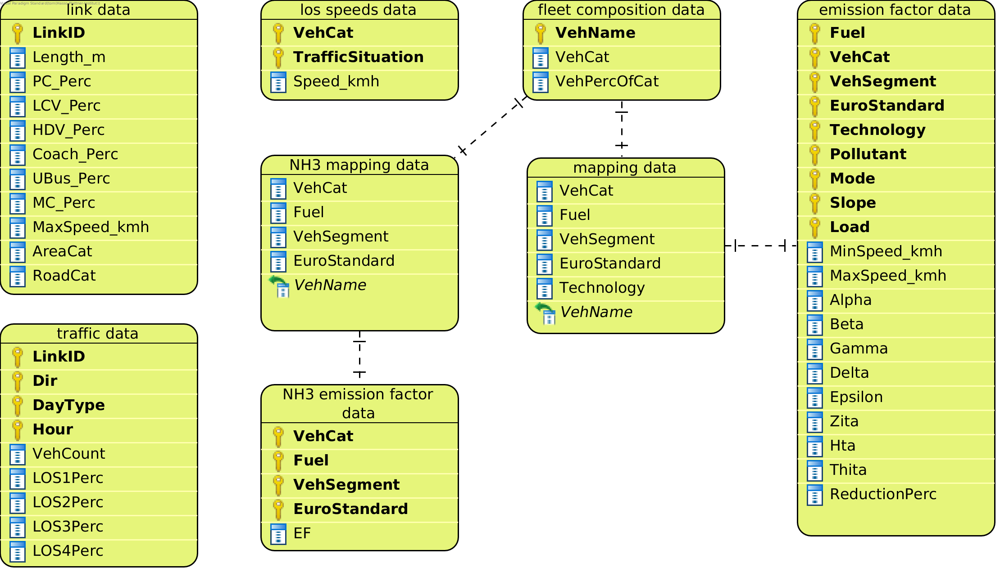
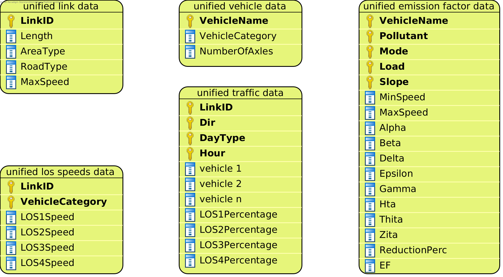

CopertHotStrategy
=================

The ``CopertHotStrategy`` implements emission calculation with the
`EEA Tier 1 methodology <https://www.eea.europa.eu/publications/emep-eea-guidebook-2016/>`_ for hot exhaust emissions
using `COPERT <http://www.emisia.com/utilities/copert/>`_ emission factors.

This Strategy uses speed-dependent emission factors with flexible speeds dependent on the level of service.
When developing YETI we had access to speed data that depended on the level of service, so we chose
to get the speed used for the COPERT emission factor calculation from there. If your speed data has a different format,
you can :ref:`add your own Strategy <add-strategy>` to work with your speed data.

Data requirements
-----------------
What data the ``CopertHotStrategy`` requires depends on the ``mode`` set in the configuration file for the run.

Data requirements for mode ``input_data``
'''''''''''''''''''''''''''''''''''''''''

:ref:`how-to-read-er`

-------

**link data** |br|
Just like the link data required for the other Strategies. Look :ref:`here <link-data-explained>`.

-------

**traffic data** |br|
Just like the traffic data required for the other Strategies. Look :ref:`here <traffic-data-explained>`.

-------

**fleet composition data** |br|
Just like the fleet composition data required for the other Strategies. Look :ref:`here <fleet-comp-data-explained>`.

-------

.. _los-speeds-data-explained:

**los speeds data** |br|
This dataset contains speed data for vehicle categories and traffic situations. It is used to find out the
speed of a vehicle for a particular level of service.

- *VehCat*: A vehicle category. Valid categories are

.. code-block:: yaml

    pass. car
    LCV
    coach
    urban bus
    motorcycle
    HGV

- *TrafficSituation*: Each value in this column is a String describing a particular
  traffic situation in the format ``{area type}/{road type}/{max speed}/{level of service}``.
  Acceptable area types are ``URB`` and ``RUR``. For level of service choose one of these values
  ``Freeflow``, ``Heavy``, ``Satur.``, or ``St+Go``. Possible road types are as follows. Please note that the
  possible road types are hard coded. If you are using different road definitions, the easiest would be to map them
  to the definitions used by YETI and work with the YETI definitions.

.. code-block:: yaml

    # possible road types
    MW-Nat.
    MW-City
    Trunk-Nat.
    Trunk-City
    Distr
    Local
    Access

.. code-block:: yaml

    # Example traffic situations
    URB/MW-City/70/Freeflow   # Freeflow is the first level of service (LOS 1)
    URB/MW-City/70/Heavy      # Heavy is the second level of service (LOS 2)
    URB/MW-City/70/Satur.     # Satur. is the third level of service (LOS 3)
    URB/MW-City/70/St+Go      # St+Go is the fourth level of service (LOS 4)

- *Speed_kmh*: The speed for a vehicle of category VehCat driving in the corresponding TrafficSituation.
  Unit: km/h

The los speeds data should contain values for all vehicle categies and for
traffic situation strings describing all street links and all los types.

*Example*:

========= ======================= =========
VehCat    TrafficSituation        Speed_kmh
========= ======================= =========
pass. car URB/MW-City/70/Freeflow 70
pass. car URB/MW-City/70/Heavy    55
pass. car URB/MW-City/70/Satur    40
pass. car URB/MW-City/70/St+Go    30
========= ======================= =========

-------

**emission factor data** |br|
This dataset contains the necessary attributes to calculate speed dependent emission factors
to be used in the calculation of hot exhaust emissions according to
`EEA methodology <https://www.eea.europa.eu/publications/emep-eea-guidebook-2016/>`_.

Note that this dataset needs to contain values for the pollutant you are using, otherwise you
will encounter errors in the emission calculation.

*Example*:

====== ============== ========== ============ ========== ========= ==== ===== ==== ============ ============ ===== ==== ===== ===== ======= ==== === ===== =============
Fuel   VehCat         VehSegment EuroStandard Technology Pollutant Mode Slope Load MinSpeed_kmh MaxSpeed_kmh Alpha Beta Gamma Delta Epsilon Zita Hta Thita ReductionPerc
====== ============== ========== ============ ========== ========= ==== ===== ==== ============ ============ ===== ==== ===== ===== ======= ==== === ===== =============
Petrol Passenger Cars Small      Euro 4       GDI        CO                        5            130          0.651 16.6 0.468 -0.48 10.1869 7.57 3   -0.79 0.3
Petrol Passenger Cars Small      Euro 4       GDI        NOx                       5            130          0.896 86.5 0.167 -0.74 6.32147 1761 97. -0.55 0
====== ============== ========== ============ ========== ========= ==== ===== ==== ============ ============ ===== ==== ===== ===== ======= ==== === ===== =============

.. _mapping-data-explained:

-------

**mapping data** |br|
This file is used to map vehicle names to their emission factor attributes in the emission factor data.

The values in the columns ``VehCat``, ``Fuel``, ``VehSegment``, ``EuroStandard``, and ``Technology`` need to match
the values in the columns of the emission factor data exactly.

The vehicle names in the column ``VehName`` need to match the the vehicle names in ``fleet composition data >> VehName``
exactly. More precisely, each vehicle in ``fleet composition data >> VehName`` needs one corresponding row
in the mapping data.

*Example*:

Say we want to construct a mapping between the following two files:

fleet composition data

======================== ====== ============ =============
VehName                  VehCat VehPercOfCat NumberOfAxles
======================== ====== ============ =============
PC petrol <1.4L Euro-1   P      0.2
LCV diesel M+N1-I Euro-2 L      0.003
======================== ====== ============ =============

emission factor data

====== ========================= ========== ============ ========== ========= ==== ===== ==== ============ ============ ===== ==== ===== ===== ======= ==== === ===== =============
Fuel   VehCat                    VehSegment EuroStandard Technology Pollutant Mode Slope Load MinSpeed_kmh MaxSpeed_kmh Alpha Beta Gamma Delta Epsilon Zita Hta Thita ReductionPerc
====== ========================= ========== ============ ========== ========= ==== ===== ==== ============ ============ ===== ==== ===== ===== ======= ==== === ===== =============
Petrol Passenger Cars            Small      Euro 4       GDI        CO                        5            130          0.651 16.6 0.468 -0.48 10.1869 7.57 3   -0.79 0.3
Diesel Light Commercial Vehicles M+N1-I     Euro 2                  NOx                       5            100          0.896 86.5 0.167 -0.74 6.32147 1761 97. -0.55 0
====== ========================= ========== ============ ========== ========= ==== ===== ==== ============ ============ ===== ==== ===== ===== ======= ==== === ===== =============

Our mapping file would look like this:

mapping data

========================= ====== ========== ============ ========== ========================
VehCat                    Fuel   VehSegment EuroStandard Technology VehName
========================= ====== ========== ============ ========== ========================
Passenger Cars            Petrol Small      Euro 4       GDI        PC petrol <1.4L Euro-1
Light Commercial Vehicles Diesel M+N1-I     Euro 2                  LCV diesel M+N1-I Euro-2
========================= ====== ========== ============ ========== ========================

-------

**nh3 mapping data** |br|
[OPTIONAL]
Like the mapping data described above, but without the column ``Technology``. Also this file is used
to construct a mapping between the fleet composition data and the nh3 emission factor data.

-------

**nh3 emission factor data** |br|
[OPTIONAL]
This file contains Tier 2 emission factor values for the pollutant NH3.

*Example*:

========================= ====== ========== =============== ====
VehCat                    Fuel   VehSegment EuroStandard    EF
========================= ====== ========== =============== ====
Passenger Cars            Petrol Small      Euro 4          0.8
Light Commercial Vehicles Diesel M+N1-I     Euro 2          4.95
========================= ====== ========== =============== ====

Data requirements for mode ``unified_data``
'''''''''''''''''''''''''''''''''''''''''''

:ref:`how-to-read-er`

--------

**unified link data** |br|
Just like the unified link data required for the other Strategies. See :ref:`here <unified-link-data-explained>`.

--------

**unified vehicle data** |br|
Just like the unified vehicle data required for the other Strategies. See :ref:`here <unified-vehicle-data-explained>`.

--------

**unified traffic data** |br|
Just like the unified traffic data required for the other Strategies. See :ref:`here <unified-traffic-data-explained>`.

--------

.. _unified-los-speeds-data-explained:

**unified los speeds data** |br|
This dataset contains data about the speeds associated with the levels of service for the links and vehicle categories
used.

- *LinkID*: The ID of a street link. Needs to match the link IDs in ``unified link data >> LinkID``.
- *VehicleCategory*: One of the following vehicle categories:

.. code-block:: yaml

    VehicleCategory.PC
    VehicleCategory.LCV
    VehicleCategory.HDV
    VehicleCategory.COACH
    VehicleCategory.UBUS
    VehicleCategory.MOPED
    VehicleCategory.MC

- *LOSxSpeed*: The average speed of vehicles belonging to the given vehicle category at the given link
  for the x level of service. Currently implemented levels of service: ``1`` (Freeflow), ``2`` (Heavy),
  ``3`` (Satur.), and ``4`` (St+Go).

*Example*:

====== =================== ========= ========= ========= =========
LinkID VehicleCategory     LOS1Speed LOS2Speed LOS3Speed LOS4Speed
====== =================== ========= ========= ========= =========
123_87 VehicleCategory.PC  44.9160   36.996669 30.752666 12.756747
123_87 VehicleCategory.LCV 44.9160   36.996669 30.752666 12.756747
123_87 VehicleCategory.HDV 39.8291   30.092407 28.670288 11.770976
====== =================== ========= ========= ========= =========

-------

**unified emission factor data** |br|

This dataset contains emission factor attributes used in the emission factor calculation with the copert methodology for
all vehicles in the fleet.

It can contain the optional column EF giving you the option to use fixed emission factors that are independent of speed.
Values in EF will be used as the emission factor for the given vehicle and pollutant
and will take precedence over the emission factor calculation with the copert methodology. If you want to
use fixed emission factors for some vehicles and speed-depend emission factors for other vehicles, you can
leave the EF blank for the vehicles that you want to use speed-dependent copert emission factors for.

Note that this dataset needs to contain values for the pollutant you are using, otherwise you
will encounter errors in the emission calculation.

- *VehicleName*: The name of a vehicle class. Needs to match the vehicle names in ``unified vehicle data >> VehicleName``
  exactly.
- *Pollutant*: One of the following pollutants:

.. code-block:: yaml

    PollutantType.NOx
    PollutantType.CO
    PollutantType.NH3
    PollutantType.VOC
    PollutantType.PM_Exhaust

- *Mode*: The mode, as used by the copert methodology.
- *Load*: The load, as used by the copert methodology. Note that the load is only used to filter the unified emission factor data.
  Only rows with load 0 or blank will be considered for the emission factor calculation.
- *Slope*: The slope, as used by the copert methodology. Note that the slope is only used to filter the unified emission factor data.
  Only rows with slope 0 or blank will be considered for the emission factor calculation.
- *EF*: [OPTIONAL] A fixed emission factor to be used for the given vehicle name and pollutant. If not blank the EF
  takes precedence over the emission calculation with the copert methodology.
- The other columns contain the attributes used in the copert emission factor calculation.

*Example*:

========================= ========= ==== ===== ==== ============ ============ ===== ==== ===== ===== ======= ==== === ===== ============= ==
VehicleName               Pollutant Mode Slope Load MinSpeed_kmh MaxSpeed_kmh Alpha Beta Gamma Delta Epsilon Zita Hta Thita ReductionPerc EF
========================= ========= ==== ===== ==== ============ ============ ===== ==== ===== ===== ======= ==== === ===== ============= ==
PC petrol <1.4L Euro-1    CO             0     0    5            130          0.651 16.6 0.468 -0.48 10.1869 7.57 3   -0.79 0.3
LCV diesel M+N1-I Euro-2  NOx                       5            100          0.896 86.5 0.167 -0.74 6.32147 1761 97. -0.55 0             3
========================= ========= ==== ===== ==== ============ ============ ===== ==== ===== ===== ======= ==== === ===== ============= ==

Supported pollutants
--------------------

CopertHotStrategy supports these pollutants:

.. code-block:: yaml

    # add one of the following lines to your config.yaml
    pollutant:  PollutantType.NOx
    pollutant:  PollutantType.CO
    pollutant:  PollutantType.NH3
    pollutant:  PollutantType.VOC
    pollutant:  PollutantType.PM_Exhaust

Make sure to include emission factors for the pollutant you are using in the emission factor data.

What to put in the config.yaml
------------------------------
If you want to use the ``CopertHotStrategy`` for your calculations, you need to set
the following options in your ``config.yaml``.
Don't forget to add the parameters specified here: :doc:`config`

If using mode ``input_data``:
'''''''''''''''''''''''''''''

.. code-block:: yaml

    strategy:                     code.copert_hot_strategy.CopertHotStrategy.CopertHotStrategy
    load_input_data_function:     code.copert_hot_strategy.load_input_data.load_copert_input_data
    load_unified_data_function:   code.copert_hot_strategy.load_unified_data.load_copert_unified_data
    validation_function:          code.script_helpers.validate_files.validate_copert_input_files

    input_link_data:              path/to/link_data.csv
    input_fleet_composition:      path/to/fleet_composition_data.csv
    input_emission_factors:       path/to/emission_factor_data.csv
    input_los_speeds:             path/to/los_speeds_data.csv
    input_traffic_data:           path/to/traffic_data.csv
    input_vehicle_mapping:        path/to/vehicle_mapping_data.csv

    use_nh3_tier2_ef:             yes or no
    # if you set use_nh3_tier2_ef to yes, also add these lines:
    input_nh3_emission_factors:   path/to/nh3_emission_factor_data.csv
    input_nh3_mapping:            path/to/nh3_mapping_data.csv

You may have data on Tier 2 emission factors for NH3. If you set ``use_nh3_tier2_ef: yes`` in the config file,
YETI will read them from the specified files and use them in the emission calculation for pollutant ``PollutantType.NH3``.

If using mode ``unified_data``:
'''''''''''''''''''''''''''''''

.. code-block:: yaml

    strategy:                     code.copert_hot_strategy.CopertHotStrategy.CopertHotStrategy
    load_unified_data_function:   code.copert_hot_strategy.load_unified_data.load_copert_unified_data
    validation_function:          code.script_helpers.validate_files.validate_copert_unified_files

    unified_emission_factors:     path/to/unified_ef_data.csv
    unified_los_speeds:           path/to/unified_los_speed_data.csv
    unified_vehicle_data:         path/to/unified_vehicle_data.csv
    unified_link_data:            path/to/unified_link_data.csv
    unified_traffic_data:         path/to/unified_traffic_data.csv

.. |br| raw:: html

     
