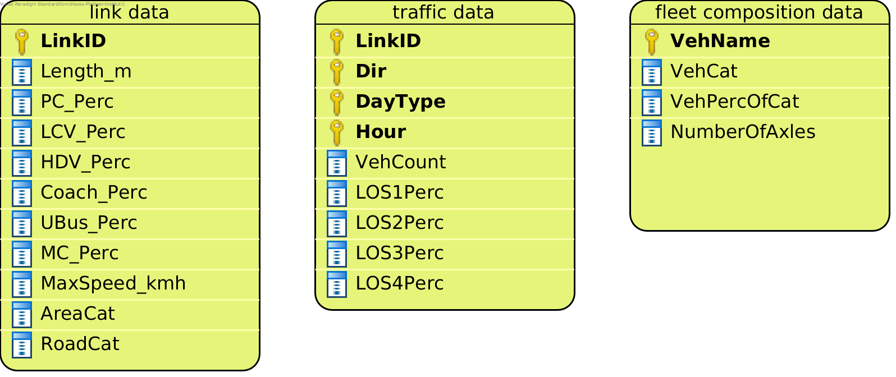
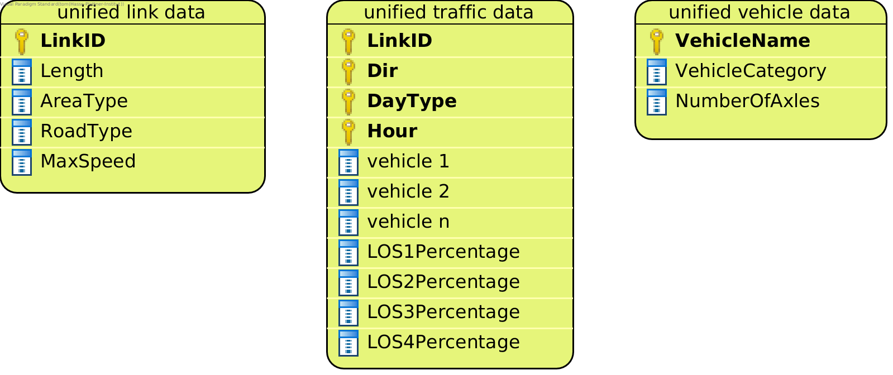

.. _data-formats:

.. include:: ../../README.rst
    :start-after: data-requirements-start-do-not-remove
    :end-before: data-requirements-end-do-not-remove

berlin_format
^^^^^^^^^^^^^

All Strategies need the following three files in ``berlin_format``:

:ref:`how-to-read-er`

.. _link-data-explained:

**link data**

This is a file with data about the street links in the region you are examining. Each street link corresponds to one line
in the link data file. These are the columns:

- *LinkID*: The unique ID for the street link
- *AreaCat*: The area category for the street link. Currently allowed area categories are:
  ``0`` for rural and ``1`` for urban. If your input data uses different categories, you
  can :doc:`change the data loading behaviour <../developer/add_load_berlin_format_data_function>` to
  support other categories.
- *RoadCat*: The road category for the street link. Currently allowed area categories are
  listed below. If your input data uses different categories, you can :doc:`change the data
  loading behaviour <../developer/add_load_berlin_format_data_function>` to support other categories.

.. code-block:: yaml

    6 = Motorway-Nat.
    5 = Motorway-City
    9 = Trunk road / Primary-Nat.
    8 = Trunk road / Primary-City
    1 = Distributer / Secondary
    3 = Loacal / Collector
    0 = Access-residential

- *MaxSpeed_kmh*: The legal maximum speed for the street link in km/h
- *PC_Perc*: The percentage of passenger cars of total traffic at the link
- *LCV_Perc*: The percentage of light commercial vehicles of total traffic at the link
- *HDV_Perc*: The percentage of heavy duty vehicles of total traffic at the link
- *Coach_Perc*: The percentage of coaches of total traffic at the link
- *UBus_Perc*: The percentage of urban buses of total traffic at the link
- *MC_Perc*: The percentage of motorcycles and mopeds of total traffic at the link

*Example*:

====== ======= ======= ============ ======= ======== ======== ========== ========= =======
LinkID AreaCat RoadCat MaxSpeed_kmh PC_Perc LCV_Perc HDV_Perc Coach_Perc UBus_Perc MC_Perc
====== ======= ======= ============ ======= ======== ======== ========== ========= =======
42_123 0       5       100          0.4     0.2      0.05     0.15       0.1       0.1
65_485 1       3       30           0.8     0.05     0        0          0.1       0.05
====== ======= ======= ============ ======= ======== ======== ========== ========= =======

.. _traffic-data-explained:

--------------

**traffic data**

This file contains the total vehicle count at for each street link, direction, day type and hour. It also contains
the distribution of traffic across the different levels of service. It has these columns:

- *LinkID*: The unique ID for the street link. The LinkIDs need to match the LinkIDs in the link data.
- *Dir*: The traffic direction for the given street link:

.. code-block:: yaml

    0 = left
    1 = right

- *DayType*: One of four day types:

.. code-block:: yaml

    1 = Monday to Thursday
    2 = Friday
    3 = Saturday
    7 = Sunday or Holiday

- *Hour*: A number between 0 and 23.
- *VehCount*: The total number of cars at the given street link for the given day type, hour and direction.
- *LOSxPerc*: The percentage of traffic attributed to the x level of service. Currently implemented levels
  of service: 1 (Freeflow), 2 (Heavy), 3 (Satur.), and 4 (St+Go).

*Example*:

====== === ======= ==== ======== ============== ============== ============== ==============
LinkID Dir DayType Hour VehCount LOS1Percentage LOS2Percentage LOS3Percentage LOS4Percentage
====== === ======= ==== ======== ============== ============== ============== ==============
42_123 0   1       0    4        1              0              0              0
65_485 1   7       9    80       0.2            0.5            0.4            0.1
====== === ======= ==== ======== ============== ============== ============== ==============

.. _fleet-comp-data-explained:

--------------

**fleet composition data**

This file contains data on the composition of the fleet. The fleet composition applies to all links. It contains these
columns:

- *VehName*: The name of a vehicle class. For example ``PC petrol <1.4L Euro-1``.
- *VehCat*: The category of the vehicle. Possible vehicle categories are:

.. code-block:: yaml

    - P = passenger cars
    - L = light commercial vehicles
    - S = heavy duty vehicles
    - R = coaches
    - B = urban buses
    - Moped = mopeds
    - M = motorcycles

- *VehPercOfCat*: The percentage of the vehicle with regard to all vehicles of its category.
- *NumberOfAxles*: The number of axles for the given vehicle. This is only relevant for vehicles belonging to one of
  these categories: ``S``, ``R``, or ``B``. This column needs to be present, however its contents are only used
  for the Strategy ``PMNonExhaustStrategy``. So if you don't have the number of axles data, you can leave the
  column blank for all other Strategies.

*Example*:

======================== ====== ============ =============
VehName                  VehCat VehPercOfCat NumberOfAxles
======================== ====== ============ =============
PC petrol <1.4L Euro-1   P      0.2
LCV diesel M+N1-I Euro-2 L      0.003
======================== ====== ============ =============

yeti_format
^^^^^^^^^^^

All Strategies work with these ``yeti_format`` datasets:

:ref:`how-to-read-er`

.. _yeti-format-link-data-explained:

**yeti_format link data**

This is a file with data about the street links in the region you are examining. Each street link
corresponds to one line in the yeti_format link data file. It has these columns:

- *LinkID*: The unique ID for the street link
- *RoadType*: The road type for the street link. Possible road categories are:

.. code-block:: yaml

    RoadType.MW_Nat = Motorway-Nat.
    RoadType.MW_City = Motorway-City
    RoadType.Trunk_Nat = Trunk road / Primary-Nat.
    RoadType.Trunk_City = Trunk road / Primary-City
    RoadType.Distr = Distributer / Secondary
    RoadType.Local = Loacal / Collector
    RoadType.Access = Access-residential

- *AreaType*: The area type for the street link. Possible area categories are:

.. code-block:: yaml

    AreaType.Urban = rural
    AreaType.Rural = urban

- *MaxSpeed*: The legal maximum speed for the street link in km/h.

*Example*:

====== ============== ================ ========
LinkID AreaType       RoadType         MaxSpeed
====== ============== ================ ========
42_123 AreaType.Rural RoadType.MW_City 100
65_485 AreaType.Urban RoadType.Local   30
====== ============== ================ ========

.. _yeti-format-traffic-data-explained:

--------------

**yeti_format traffic data**

This file contains vehicle count data for every vehicle in yeti_format vehicle data and for each street link, direction,
day type and hour. It has these columns:

- *LinkID*: The unique ID for the street link. The LinkIDs need to match the LinkIDs in the yeti_format link data.
- *Dir*: The traffic direction for the given street link:

.. code-block:: yaml

    Dir.R = right
    Dir.L = left

- *DayType*: One of four day types:

.. code-block:: yaml

    DayType.MONtoTHU = Monday to Thursday
    DayType.FRI = Friday
    DayType.SAT = Saturday
    DayType.SUN = Sunday or Holiday

- *Hour*: A number between 0 and 23.
- *vehicle i*: The number of vehicles belonging to class ``vehicle i`` at the street link for the
  given day type, hour and direction. The file needs to contain vehicle count columns for
  all vehicle names in the yeti_format vehicle data.
- *LOSxPercentage*: The percentage of traffic attributed to the x level of service. Currently implemented levels
  of service: 1 (Freeflow), 2 (Heavy), 3 (Satur.), and 4 (St+Go).

*Example*

====== ===== ================ ==== ====================== ========================
LinkID Dir   DayType          Hour PC petrol <1.4L Euro-1 LCV diesel M+N1-I Euro-2
====== ===== ================ ==== ====================== ========================
42_123 Dir.L DayType.MONtoTHU 0    0.32                   0.0023999999
65_485 Dir.R DayType.SUN      9    12.8                   0.012
====== ===== ================ ==== ====================== ========================

.. _yeti-format-vehicle-data-explained:

--------------

**yeti_format vehicle data**

A dataset linking each vehicle class to its category.

- *VehicleName*: The name of a vehicle class. For example ``PC petrol <1.4L Euro-1``.
- *VehicleCategory*: The vehicle category the vehicle class belongs to. These are the possible categories:

.. code-block:: yaml

    VehicleCategory.PC = passenger cars
    VehicleCategory.LCV = light commercial vehicles
    VehicleCategory.HDV = heavy duty vehicles
    VehicleCategory.COACH = coaches
    VehicleCategory.UBUS = urban buses
    VehicleCategory.MOPED = mopeds
    VehicleCategory.MC = motorcycles

- *NumberOfAxles*: The number of axles for the given vehicle. This is only relevant for vehicles belonging to one of
  these categories: ``VehicleCategory.HDV``, ``VehicleCategory.COACH``, or ``VehicleCategory.UBUS``.
  This column needs to be present, however its contents are only used
  for the Strategy ``PMNonExhaustStrategy``. So if you don't have the number of axles data, you can leave the
  column blank for all other Strategies.

*Example*

======================== =================== =============
VehicleName              VehicleCategory     NumberOfAxles
======================== =================== =============
PC petrol <1.4L Euro-1   VehicleCategory.PC
LCV diesel M+N1-I Euro-2 VehicleCategory.LCV
======================== =================== =============