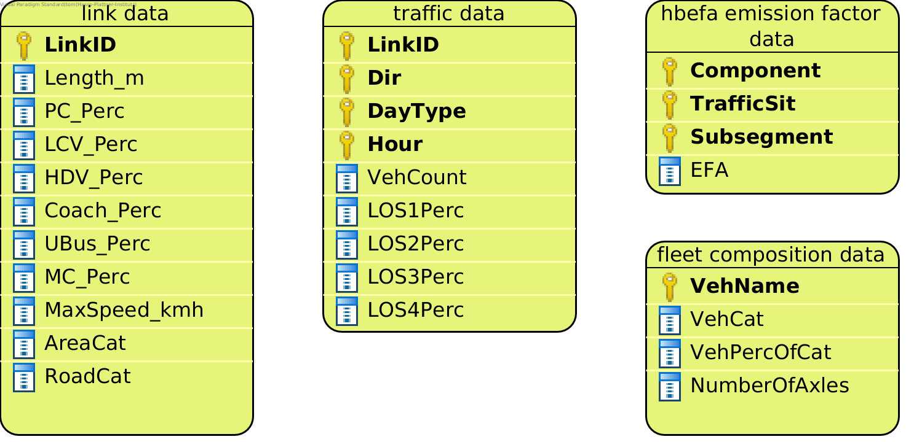
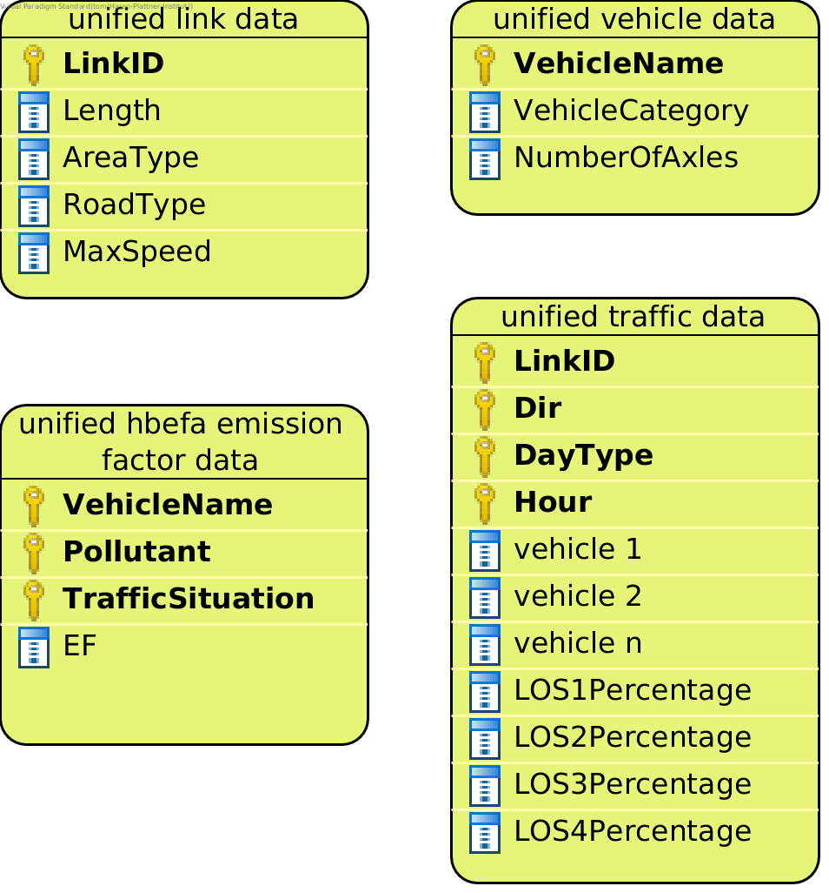

HbefaHotStrategy
================

``HbefaHotStrategy`` implements emission calculation with the HBEFA methodology for hot exhaust emissions.
It uses emission factors that are dependent on the vehicle and the traffic situation.

We used HBEFA emission factors and values from the `database <https://www.hbefa.net/e/index.html>`_ v3.3.

Data Requirements
-----------------

What data the ``HbefaHotStrategy`` requires depends on the ``mode`` set in the configuration file for the run.

Data requirements for mode ``berlin_format``
''''''''''''''''''''''''''''''''''''''''''''

:ref:`how-to-read-er`

--------

**link data** |br|
Just like the link data required for the other Strategies. See :ref:`here <link-data-explained>`.

--------

**traffic data** |br|
Just like the traffic data required for the other strategies. See :ref:`here <traffic-data-explained>`.

--------

**fleet composition data** |br|
Just like the fleet composition data required for the other Strategies. See :ref:`here <fleet-comp-data-explained>`.

--------

**hbefa emission factor data** |br|
A dataset with HBEFA emission factors.

Note that this dataset needs to contain values for the pollutants you are using, otherwise you
will encounter errors in the emission calculation.

- *Component*: A pollutant. Accepted pollutants are:

.. code-block:: yaml

    NOx
    CO
    NH3
    VOC
    PM Exhaust
    PM  # interpreted as PM Exhaust

- *TrafficSit*: A String describing a particular traffic situation in the format ``{area type}/{road type}/{max speed}/{level of service}``.
  Acceptable area types are ``URB`` and ``RUR``. For level of service choose one of these values
  ``Freeflow``, ``Heavy``, ``Satur.``, or ``St+Go``. Possible road types are

.. code-block:: yaml

    MW-Nat.
    MW-City
    Trunk-Nat.
    Trunk-City
    Distr
    Local
    Access

.. code-block:: yaml

    # Example traffic situations
    URB/MW-City/70/Freeflow   # Freeflow is the first level of service (LOS 1)
    URB/MW-City/70/Heavy      # Heavy is the second level of service (LOS 2)
    URB/MW-City/70/Satur.     # Satur. is the third level of service (LOS 3)
    URB/MW-City/70/St+Go      # St+Go is the fourth level of service (LOS 4)

- *Subsegment*: A vehicle name. The values in Subsegment need to match the values in ``fleet composition data >> VehName``
  exactly.
- *EFA*: The emission factor for the component, traffic situation and subsegment in the same row.

*Example*

========= ======================= ====================== ===
Component TrafficSit              Subsegment             EFA
========= ======================= ====================== ===
NOx       URB/MW-City/70/Freeflow PC petrol <1.4L Euro-1 1.5
NOx       URB/MW-City/70/Heavy    PC petrol <1.4L Euro-1 1.6
NOx       URB/MW-City/70/Satur.   PC petrol <1.4L Euro-1 1.7
NOx       URB/MW-City/70/St+Go    PC petrol <1.4L Euro-1 1.8
========= ======================= ====================== ===

Data requirements for mode ``yeti_format``
''''''''''''''''''''''''''''''''''''''''''

:ref:`how-to-read-er`

--------

**yeti_format link data** |br|
Just like the yeti_format link data required for the other Strategies. See :ref:`here <yeti-format-link-data-explained>`.

--------

**yeti_format traffic data** |br|
Just like the yeti_format traffic data required for the other strategies. See :ref`here <yeti-format-traffic-data-explained>`.

--------

**yeti_format vehicle data** |br|
Just like the yeti_format link data required for the other Strategies. See :ref:`here <yeti-format-vehicle-data-explained>`.

--------

**yeti_format hbefa emission factor data** |br|
A dataset with HBEFA emission factors.

Note that this dataset needs to contain values for the pollutants you are using, otherwise you
will encounter errors in the emission calculation.

- *Pollutant*: A pollutant. Accepted pollutants are:

.. code-block:: yaml

    PollutantType.NOx
    PollutantType.CO
    PollutantType.NH3
    PollutantType.VOC
    PollutantType.PM_Exhaust

- *TrafficSituation*: Just like the column TrafficSit in the hbefa emission factor data for mode ``berlin_format``

- *VehicleName*: A vehicle name. The values in this column need to match the values in
  ``yeti_format vehicel data >> VehicleName`` exactly.
- *EF*: The emission factor for the pollutant, traffic situation and vehicle name in the same row.

*Example*

================= ======================= ====================== ===
Pollutant         TrafficSituation        VehicleName            EF
================= ======================= ====================== ===
PollutantType.NOx URB/MW-City/70/Freeflow PC petrol <1.4L Euro-1 1.5
PollutantType.NOx URB/MW-City/70/Heavy    PC petrol <1.4L Euro-1 1.6
PollutantType.NOx URB/MW-City/70/Satur    PC petrol <1.4L Euro-1 1.7
PollutantType.NOx URB/MW-City/70/St+Go    PC petrol <1.4L Euro-1 1.8
================= ======================= ====================== ===

Supported pollutants
--------------------

``HbefaHotStrategy`` supports these pollutants:

.. code-block:: yaml

    PollutantType.NOx
    PollutantType.CO
    PollutantType.NH3
    PollutantType.VOC
    PollutantType.PM_Exhaust

Set the pollutants for a run in your config file. For example:

.. code-block:: yaml

    pollutants:          [PollutantType.CO, PollutantType.NOx]

Make sure to include emission factors for the pollutants you are using in the emission factor data.

What to put in the config.yaml
------------------------------

If you want to use the ``HbefaHotStrategy`` for your calculations, you need to set
the following options in your ``config.yaml``.
Don't forget to add the parameters specified here: :doc:`config`

If using mode ``berlin_format``:
''''''''''''''''''''''''''''''''

.. code-block:: yaml

    strategy:                     code.hbefa_hot_strategy.HbefaHotStrategy.HbefaHotStrategy
    load_berlin_format_data_function:     code.hbefa_hot_strategy.load_berlin_format_data.load_hbefa_hot_berlin_format_data
    load_yeti_format_data_function:   code.hbefa_hot_strategy.load_yeti_format_data.load_hbefa_hot_yeti_format_data
    validation_function:          code.hbefa_hot_strategy.validate.validate_hbefa_berlin_format_files

    berlin_format_link_data:              path/to/link_data.csv
    berlin_format_fleet_composition:      path/to/fleet_composition_data.csv
    berlin_format_emission_factors:       path/to/hbefa_emission_factor_data.csv
    berlin_format_traffic_data:           path/to/traffic_data.csv

If using mode ``yeti_format``:
'''''''''''''''''''''''''''''''

.. code-block:: yaml

    strategy:                     code.hbefa_hot_strategy.HbefaHotStrategy.HbefaHotStrategy
    load_yeti_format_data_function:   code.hbefa_hot_strategy.load_yeti_format_data.load_hbefa_hot_yeti_format_data
    validation_function:          code.hbefa_hot_strategy.validate.validate_hbefa_yeti_format_files

    yeti_format_emission_factors:     path/to/yeti_format_hbefa_ef_data.csv
    yeti_format_vehicle_data:         path/to/yeti_format_vehicle_data.csv
    yeti_format_link_data:            path/to/yeti_format_link_data.csv
    yeti_format_traffic_data:         path/to/yeti_format_traffic_data.csv

.. |br| raw:: html

     