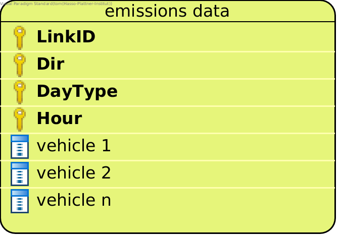

Output data
============

Data format
-----------

The model outputs one or multiple csv files. How many files are generated depends on the
Strategy used for the run.

The output files will be in this format:

:ref:`how-to-read-er`

- *LinkID*: The ID for the street link this row contains emissions data for.
- *Dir*: The traffic direction. ``Dir.R`` or ``Dir.L``.
- *DayType*: One of four day types. ``DayType.MONtoTHU``, ``DayType.FRI``, ``DayType.SAT``, or ``DayType.SUN``.
- *Hour*: A number between 0 and 23.
- *vehicle i*: The emissions for the vehicle class named 'vehicle i' at the street link and for the given direction,
  day type and hour. A real number.

Note that the emission columns match the vehicle names given in the fleet composition data file
(if using data in ``berlin_format``) or the vehicle data file (if using data in ``yeti_format``).

Output location
---------------

In the config file you specify an ``output_folder``. The model outputs will be in the specified ``output_folder``.

files in yeti_format
------------------

If you are using mode ``berlin_format``, YETI generates files in unifed_data format during the run. These files are saved
in ``output_folder``. If you specify ``output_folder_for_yeti_format_data`` in the config file, the ``yeti_format``
files will be in ``output_folder_for_yeti_format_data`` instead.