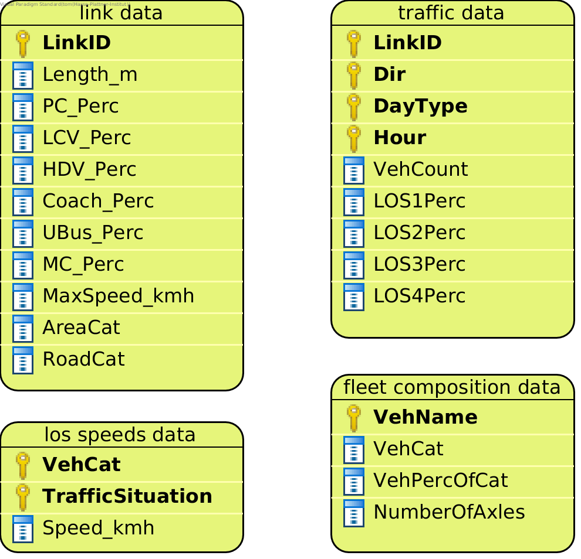
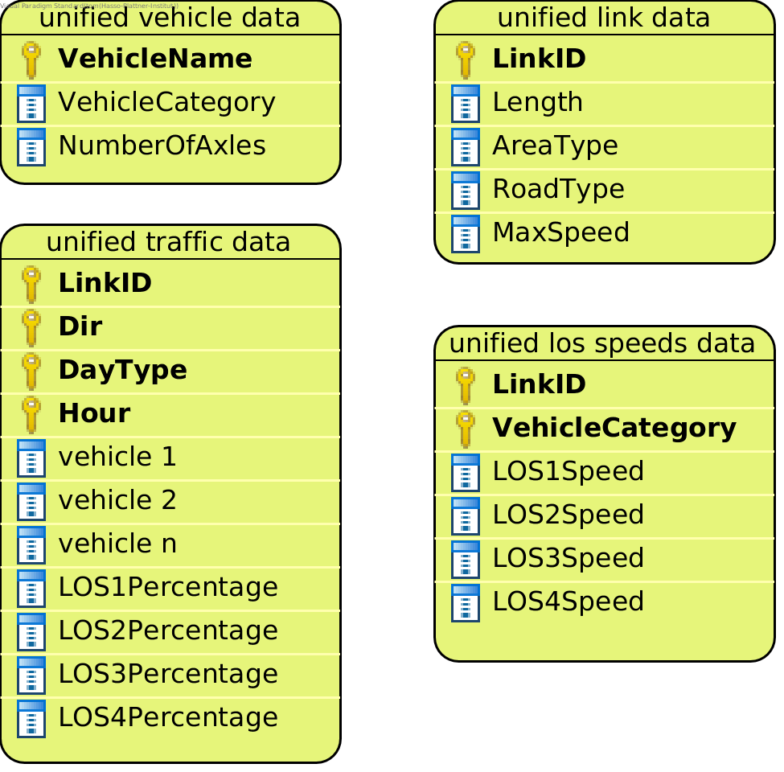

PMNonExhaustStrategy
====================

The ``PMNonExhaustStrategy`` implements emission calculation for PM from non-exhaust emissions.
Sources for PM non-exhaust emissions are tyre wear, brake wear and road surface emissions.

It uses a global assumption about the load_factor for trucks. You need to specify the assumed load_factor
in the configuration file as a number between 0 and 1.

This Strategy calculates TSP, PM 10, and PM 2.5 emissions independently
for tyre wear, brake wear, and road surface wear. Then it adds up the emissions
from all sources to obtain total PM non-exhaust emissions for TSP, PM 10, and PM 2.5. 

Output of a model run with this Strategy are three csv files:

- TSP emissions
- PM 10 emissions
- PM 2.5 emissions

Data Requirements
-----------------

What data the ``PMNonExhaustStrategy`` requires depends on the ``mode`` set in the configuration file for the run.

Data requirements for mode ``berlin_format``
''''''''''''''''''''''''''''''''''''''''''''

:ref:`how-to-read-er`

--------

**link data** |br|
Just like the link data required for the other Strategies. See :ref:`here <link-data-explained>`.

--------

**traffic data** |br|
Just like the traffic data required for the other Strategies. See :ref:`here <traffic-data-explained>`.

--------

**fleet composition data** |br|
Just like the fleet composition data required for the other Strategies. See :ref:`here <fleet-comp-data-explained>`.

--------

**los speeds data** |br|
Just like the los speeds data data required for the ``CopertHotStrategy``. See :ref:`here <los-speeds-data-explained>`.

Data requirements for mode ``yeti_format``
'''''''''''''''''''''''''''''''''''''''''''

:ref:`how-to-read-er`

--------

**yeti_format link data** |br|
Just like the yeti_format link data required for the other Strategies. See :ref:`here <yeti-format-link-data-explained>`.

--------

**yeti_format vehicle data** |br|
Just like the yeti_format vehicle data required for the other Strategies. See :ref:`here <yeti-format-vehicle-data-explained>`.

--------

**yeti_format traffic data** |br|
Just like the yeti_format traffic data required for the other Strategies. See :ref:`here <yeti-format-traffic-data-explained>`.

--------

**yeti_format los speeds data** |br|
Just like the yeti_format los speeds data data required for the ``CopertHotStrategy``. See :ref:`here <yeti-format-los-speeds-data-explained>`.

Supported Pollutants
--------------------

The only pollutant supported by this Strategy is ``PollutantType.PM_Non_Exhaust``. Set it in the config file:

.. code-block:: yaml

    pollutants:              [PollutantType.PM_Non_Exhaust]

What to put in the config.yaml
------------------------------
If you want to use the ``PMNonExhaustStrategy`` for your calculations, you need to set
the following options in your ``config.yaml``.
Don't forget to add the parameters specified here: :doc:`config`

If using mode ``berlin_format``:
''''''''''''''''''''''''''''''''

.. code-block:: yaml

    strategy:                     code.pm_non_exhaust_strategy.PMNonExhaustStrategy.PMNonExhaustStrategy
    load_berlin_format_data_function:     code.pm_non_exhaust_strategy.load_berlin_format_data.load_pm_non_exhaust_berlin_format_data
    load_yeti_format_data_function:   code.pm_non_exhaust_strategy.load_yeti_format_data.load_pm_non_exhaust_yeti_format_data
    validation_function:          code.pm_non_exhaust_strategy.validate.validate_pm_non_exhaust_berlin_format_files

    berlin_format_link_data:              path/to/link_data.csv
    berlin_format_fleet_composition:      path/to/fleet_composition_data.csv
    berlin_format_los_speeds:             path/to/los_speeds_data.csv
    berlin_format_traffic_data:           path/to/traffic_data.csv

    load_factor:                  0.3  # A number between 0 and 1. The assumption about the average load of trucks.

If using mode ``yeti_format``:
'''''''''''''''''''''''''''''''

.. code-block:: yaml

    strategy:                     code.pm_non_exhaust_strategy.PMNonExhaustStrategy.PMNonExhaustStrategy
    load_yeti_format_data_function:   code.pm_non_exhaust_strategy.load_yeti_format_data.load_pm_non_exhaust_yeti_format_data
    validation_function:          code.pm_non_exhaust_strategy.validate.validate_pm_non_exhaust_yeti_format_files

    yeti_format_link_data:            path/to/yeti_format_link_data.csv
    yeti_format_vehicle_data:         path/to/yeti_format_vehicle_data.csv
    yeti_format_los_speeds:           path/to/yeti_format_los_speed_data.csv
    yeti_format_traffic_data:         path/to/yeti_format_traffic_data.csv

    load_factor:                  0.3  # A number between 0 and 1. The assumption about the average load of trucks.

.. |br| raw:: html

     
